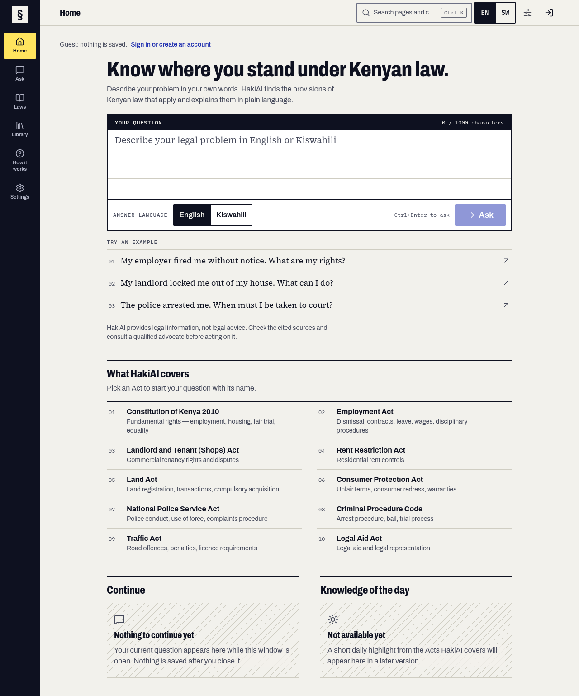
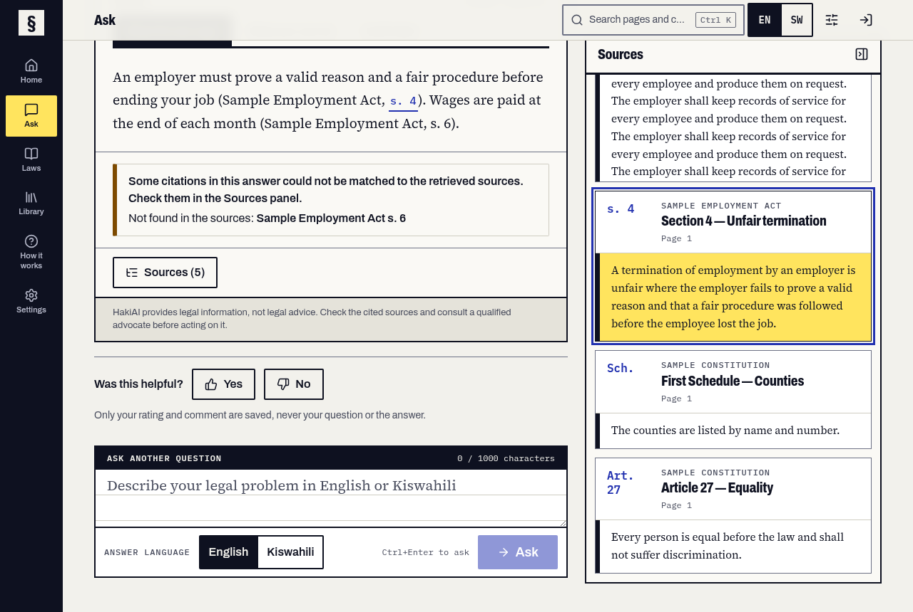
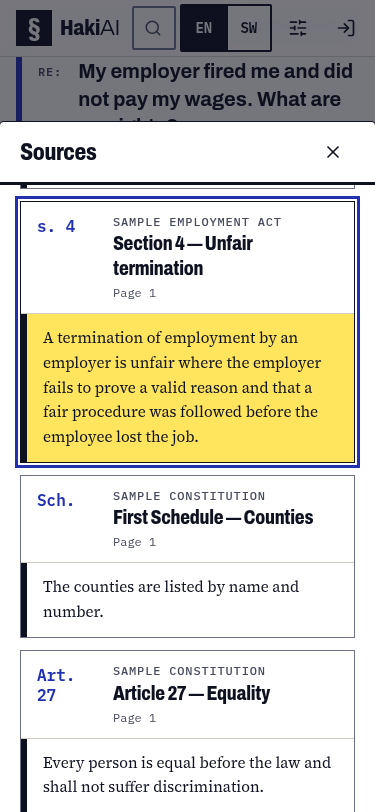
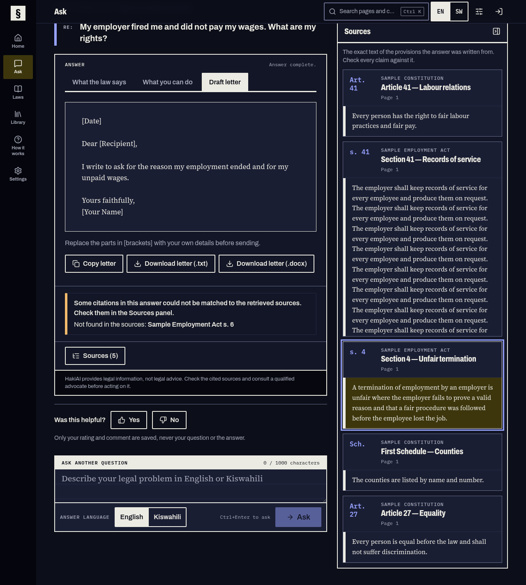
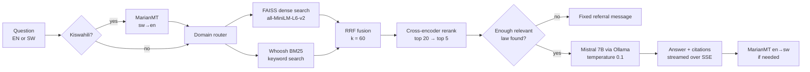

<div align="center">

# § HakiAI

**Know where you stand under Kenyan law.**

An offline legal-information assistant for Kenyan citizens. Ask a question in plain English or Kiswahili and get an
answer built only from the text of Kenyan statutes, with every claim linked to the section it came from.


[](https://github.com/raykl640/ICS-PROJECT/releases/latest)



</div>

> [!IMPORTANT]
> HakiAI gives **legal information, not legal advice**. Always check the cited sections and consult a qualified advocate
> before acting. See [docs/LIMITATIONS.md](docs/LIMITATIONS.md).

## Why

Most Kenyans facing a dismissal, an eviction or an arrest cannot easily afford a lawyer, and statute text is hard to find
and harder to read. HakiAI puts the relevant law in front of them in plain language, cites the exact section, and drafts
a letter they can send. It runs entirely on one ordinary laptop: no internet connection, no cloud service, and no
question ever leaves the machine.

## What it does

| | |
|---|---|
| **Answers in three parts** | What the law says, what you can do, and a draft formal letter (export as .txt or .docx). |
| **Shows its sources** | The exact statute sections the answer was written from, verbatim. Click a citation to jump to it. |
| **Refuses to guess** | If no relevant provision is found, it says so and points to an advocate instead of inventing an answer. |
| **English and Kiswahili** | Ask in either language; answers are translated back with a legal glossary. |
| **Laws browser** | Read all 25 Acts section by section, follow cross-references, and search the full text. |
| **Private accounts** | Optional local accounts with encrypted history (argon2id + AES-256-GCM), a library of chats, letters, saved sections and notes, and a recovery code. Guests can use everything without signing in. |
| **Accessible** | Keyboard shortcuts and command palette, light/dark and high-contrast themes, adjustable text size, reduced motion; checked with axe. |

<table>
  <tr>
    <td width="68%"></td>
    <td width="32%"></td>
  </tr>
  <tr>
    <td colspan="2"></td>
  </tr>
</table>

<sub>Screenshots use the small synthetic test corpus, not the real statutes.</sub>

## Install

HakiAI runs on one laptop: 64-bit Windows 10/11 or Linux, 8 GB of RAM and about 10 GB of free disk. The first start
downloads the AI models (about 5 GB) once; after that it works with no internet connection.

### Windows

1. Download **[HakiAI-Setup-x64.exe](https://github.com/raykl640/ICS-PROJECT/releases/latest/download/HakiAI-Setup-x64.exe)**
   and run it. It installs for your user only, so no administrator password is needed.
2. Leave **Install Ollama** ticked if the installer offers it. Ollama is the local AI engine HakiAI writes its answers
   with.
3. Open **HakiAI** from the Start menu. A small window shows the progress (the first start downloads the models), then
   HakiAI opens in your web browser. Keep that window open while you use HakiAI; close it to quit.

> [!NOTE]
> The installer is not code-signed yet, so Windows may show "Windows protected your PC". Choose **More info → Run
> anyway**. Each release lists a `.sha256` checksum for the installer. To uninstall, use **Settings → Apps**; it asks
> whether to keep your accounts and history.

### Linux (any distribution)

Paste this into a terminal:

```bash
curl -fsSL https://raw.githubusercontent.com/raykl640/ICS-PROJECT/main/scripts/install.sh | bash
```

It installs HakiAI for your user (no root needed), adds it to your applications menu and as the `hakiai` command, and
checks the download's checksum. It then offers to install Ollama with Ollama's official installer, which asks for your
password, and to download the AI models straight away. Start HakiAI from the menu or with `hakiai`; it opens in your
browser.

Works on 64-bit (x86_64) distributions with glibc 2.35 or newer: Ubuntu 22.04+, Debian 12+, Fedora 36+, Linux Mint 21+,
Arch and others of the same age. Options go after `bash -s --`:

| Command | Does |
|---|---|
| `… \| bash -s -- --version v2.0.0` | Install a specific release instead of the latest |
| `… \| bash -s -- --no-ollama --no-setup` | Skip the Ollama offer and the model download |
| `… \| bash -s -- --uninstall` | Remove HakiAI (asks before deleting your accounts and history) |

### From source (developers)

This is how the project is developed and works on any system with Python 3.11, Node.js 20+ and
[Ollama](https://ollama.com). The parsed corpus (`data/processed/chunks.json`) is in the repository; the statute PDFs
listed in [data/sources.yaml](data/sources.yaml) are needed only to rebuild it.

```bash
git clone https://github.com/raykl640/ICS-PROJECT.git && cd ICS-PROJECT
python3.11 -m venv .venv && source .venv/bin/activate
pip install -r backend/requirements-dev.txt
(cd frontend && npm ci && npm run build)
python scripts/setup_offline.py      # one time, with internet: models, Mistral, indexes
./scripts/run.sh                     # then open http://127.0.0.1:8000  (Windows: scripts\run.ps1)
```

No models or PDFs at hand? `make api-fake` plus `cd frontend && npm run dev` runs the whole UI on a synthetic corpus with
fake models. `python -m backend.app.desktop` starts the same launcher the installers ship.

Full guide, Docker, building the installers yourself, and troubleshooting: **[docs/SETUP.md](docs/SETUP.md)**.

## Laws covered

Constitution of Kenya 2010 · Employment Act · Landlord and Tenant (Shops) Act · Rent Restriction Act · Land Act ·
Consumer Protection Act · National Police Service Act · Criminal Procedure Code · Traffic Act · Legal Aid Act ·
Labour Relations Act · Penal Code · Evidence Act · Civil Procedure Act · Small Claims Court Act · Limitation of Actions Act ·
Land Registration Act · Marriage Act · Matrimonial Property Act · Law of Succession Act · Counter-Trafficking in Persons Act ·
Refugees Act · Public Health Act · Mental Health Act · HIV and AIDS Prevention and Control Act

The 25 Acts are parsed into 3,157 section-level chunks, each keeping its Act, Part, section number, title and page.

## How it works



1. **Retrieve.** Hybrid search: dense embeddings catch lay wording ("fired"), BM25 catches exact terms ("section 41").
2. **Rerank.** A cross-encoder scores each candidate against the question and keeps the best five.
3. **Generate.** A local Mistral 7B writes the answer only from those five sections and must cite each claim.
4. **Verify.** Citations are checked against the retrieved sections, and unmatched ones are flagged in the answer.

Details: [docs/ARCHITECTURE_AS_BUILT.md](docs/ARCHITECTURE_AS_BUILT.md).

## Tech stack

| Layer | Tools |
|---|---|
| Ingestion | pdfplumber, legal-structure regex parser |
| Retrieval | sentence-transformers, FAISS, Whoosh BM25, ms-marco cross-encoder |
| Generation | Mistral 7B Instruct (Q4_K_M) on Ollama |
| Language | langdetect, Helsinki-NLP MarianMT |
| API | FastAPI with Server-Sent Events, SQLite for accounts |
| Frontend | React 19, TypeScript, Vite, Tailwind CSS 4, Radix UI |
| Quality | pytest, vitest, Playwright + axe, ruff, mypy (strict) |

## Testing

Every model sits behind an interface with a fake, so the full test suite runs with no downloads, no GPU and the network
switched off.

```bash
./scripts/check.sh                   # ruff + mypy + pytest (coverage gate 85%)
cd frontend && npm test && npm run e2e
```

## Project layout

```text
backend/app/    FastAPI app: ingestion, retrieval, generation, lang, accounts, laws, evaluation
backend/tests/  pytest suite with fakes for every model
frontend/       React single-page app (vitest unit tests, Playwright end-to-end tests)
desktop/        packaged app: PyInstaller spec, Windows installer script, icons
data/           sources.yaml and the parsed corpus (chunks.json); PDFs and indexes stay local
eval/           retrieval and functional evaluation, usability survey
scripts/        setup, run, install, desktop builds, checks and benchmarks
docs/           specification, design, deviations, limitations, progress
```

## Documentation

| Document | For |
|---|---|
| [User guide](docs/USER_GUIDE.md) | People using the app |
| [Setup](docs/SETUP.md) | Installing, running, testing and evaluating |
| [Architecture (as built)](docs/ARCHITECTURE_AS_BUILT.md) | How it works, with diagrams |
| [Limitations](docs/LIMITATIONS.md) | Hallucination, translation quality, corpus freshness, hardware |
| [Deviations](docs/DEVIATIONS.md) | Every difference from the original specification, and why |
| [Traceability](docs/TRACEABILITY.md) | Objectives → requirements → code → tests |
| [Progress](docs/PROGRESS.md) | Build log and measurements |
| [Licences](docs/LICENSES.md) | Third-party licences and dependency audit |

## Roadmap

- Knowledge of the day, life-situation guides and a glossary browser
- Desktop window (instead of the browser) with a graphical first-run setup wizard and a USB offline bundle
- Human-reviewed Kiswahili interface strings and evaluation ground truth

## Author and licence

Lukorito Ray Khayota, BSc Informatics and Computer Science, Strathmore University.
Academic project, all rights reserved: see [LICENSE](LICENSE). Third-party components keep their own licences
([docs/LICENSES.md](docs/LICENSES.md)).
