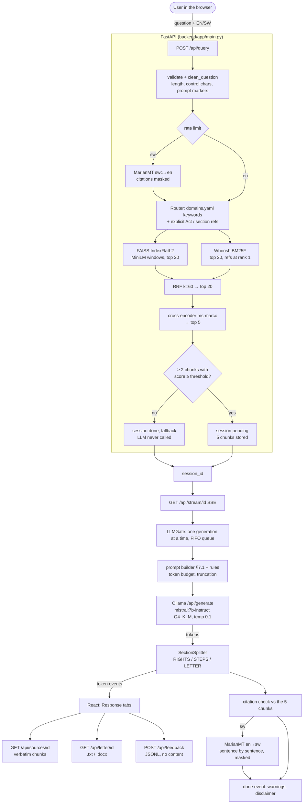
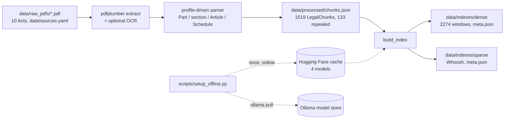

# HakiAI: architecture as built (v1.0)

This describes the system that exists in the repository. The specification is [ARCHITECTURE.md](ARCHITECTURE.md), names and
signatures are in [DESIGN.md](DESIGN.md), and every intentional difference is logged with its reason in
[DEVIATIONS.md](DEVIATIONS.md). The table at the end summarises those differences.

## 1. Query flow

## 2. Offline build path

Every index records the corpus hash and embedding model in `meta.json`. A stale or missing index stops startup with the
rebuild command (`IndexMismatchError`), and `python -m backend.app.preflight` reports the same problem before launch.

## 3. Components

| Stage (ARCHITECTURE) | Package / module | Heavy dependency behind an interface | Fake for tests |
|---|---|---|---|
| 1 Ingestion | `ingestion/download.py`, `extract.py` | pdfplumber, optional Tesseract (`OcrEngine`) | `FakeOcrEngine` |
| 2 Parsing | `ingestion/parse.py`, `profiles.py`, `report.py`, `build_corpus.py` | — | synthetic reportlab PDFs |
| 3 Indexing | `retrieval/windows.py`, `embedder.py`, `dense.py`, `sparse.py`, `store.py`, `meta.py`, `ingestion/build_index.py` | sentence-transformers (`Embedder`) | `FakeEmbedder` |
| 4 Retrieval | `retrieval/router.py` + `domains.yaml`, `refs.py`, `rrf.py`, `hybrid.py` | — | — |
| 5 Reranking | `retrieval/reranker.py`, `pipeline.py` | cross-encoder (`CrossEncoderLike`) | `FakeReranker` |
| 6 Generation | `generation/prompt.py`, `budget.py`, `llm.py`, `parse.py`, `citations.py`, `service.py`, `gate.py` | Ollama (`LLMClient`) | `FakeLLM` |
| 6b Language | `lang/detect.py`, `segment.py`, `translator.py`, `protect.py`, `glossary.py`, `service.py` | MarianMT (`Translator`) | `FakeTranslator` |
| 7 Delivery | `main.py`, `stream.py`, `sessions.py`, `letter.py`, `feedback.py`, `security.py`, `web.py`, `deps.py`, `devstack.py` | — | `HAKI_FAKE_BACKENDS=1` |
| 7 Frontend | `frontend/src/` (React 19, Vite, Tailwind 4) | — | mock EventSource (vitest), Playwright e2e |
| Evaluation | `evaluation/` + `eval/*.py` entry points | the real stack via HTTP | fake stack |
| Operations | `offline.py` (setup), `preflight.py` (run checks), `scripts/run.sh`, `run.ps1`, `Dockerfile` | — | injected tools |

Configuration lives only in `backend/app/config.py` (pydantic-settings, env prefix `HAKI_`). The frontend mirrors two
limits in `frontend/src/limits.json`, and a test fails if they drift.

## 4. Runtime properties

- **Offline:** at runtime `HF_HUB_OFFLINE=1` and `TRANSFORMERS_OFFLINE=1` are set before models load. Ollama is local. The
  frontend calls only its own origin (CSP `connect-src 'self'`).
- **Concurrency:** retrieval runs in worker threads. Generation goes through one `LLMGate` slot with a FIFO queue
  (`max_queue` 8, then 503 `busy`). Client disconnect closes the Ollama stream and frees the slot.
- **State:** in-memory sessions (TTL 1 h, at most 200) and per-IP token buckets (10/min). Feedback is appended to
  `data/feedback.jsonl` under a file lock.
- **Privacy:** logs are JSON lines with ids, timings, counts and error codes. Question, answer and chunk text are redacted
  unless `HAKI_LOG_CONTENT=true`.
- **Measured on the development laptop** (Ryzen 7 PRO 5850U, 16 threads, 15 GiB RAM, CPU only): retrieval + rerank p50
  855 ms / p95 1033 ms; cold time to first token 78.5 s / 218.6 s and a full answer in 151 s / 304 s (M7 / M10 runs, ~440 tokens); API
  startup 10 s. See [PROGRESS.md](PROGRESS.md) M4, M7 and M10.

## 5. Differences from the specification

| Spec | As built | Entry |
|---|---|---|
| §4.1 one vector per section | header-prefixed word windows (180 words / stride 120), chunk score = best window; vectors L2-normalised | D1, D2, D12 |
| §5.2 domain filter on FAISS only | filter on both indexes, per-leg widening below 5 hits, explicit Act/section/Article refs override and inject | D3 |
| §2 all sections indexed | repealed sections kept in chunks.json but not indexed; preamble, TOC, amendment notes not chunked; Schedules are one chunk each | D4, D11 |
| §7.1 prompt verbatim | §7.1 text plus fixed rules (headers, citation format, placeholders, question-as-data); token budget with truncation | D5, D14 |
| §7.5 "above a threshold" | inclusive `>=`; threshold 0.0 until tuned with human ground truth | D13 |
| §8.2 translate before streaming | English draft streams live; `translated` event replaces it; citations masked through MarianMT | D6, D15 |
| §8.2 opus-mt-sw-en | opus-mt-swc-en (sw-en does not exist on the Hub) | D15 |
| §8 five endpoints | six (adds POST /api/feedback); richer SSE events; explicit session states | D7, D8, D16 |
| §7.4 manual verification only | automatic citation check against the 5 chunks, warning in the UI | D9 |
| §9 frontend | TS port of the section splitter; limits mirrored with a contract test; verified-only referral list | D17 |
| §10 evaluation (implicit) | evaluation package with bootstrap CIs, threshold sweep, grounding checks, rating agreement, SUS | D18 |
| — operations | offline setup with offline verification, preflight checks, run scripts, Docker files (not built here), portable feedback lock | D19 |
